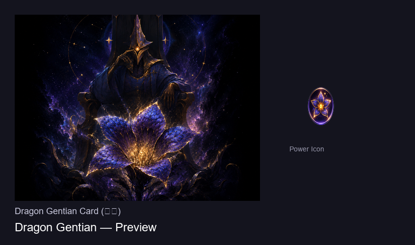

# 龙胆 (Dragon Gentian) — 杀戮尖塔2 模组

[English](#english) | [中文](#中文)

---

<a name="english"></a>
## English

### Overview

**Dragon Gentian** is a custom card mod for **Slay the Spire 2** that adds a unique Power card for the **Regent** character. The card grants the ability to freely interchange **Starbright** and **Energy** at a 1:1 ratio — any resource can be spent as the other.

This mod was inspired by the Regent's dual-resource system and aims to provide more flexibility in deck-building and combat decision-making.



---

### The Card

| Property | Base | Upgraded |
|----------|------|----------|
| **Name** | Dragon Gentian (龙胆) | Dragon Gentian+ |
| **Cost** | 2 Energy | 1 Energy |
| **Type** | Power | Power |
| **Rarity** | Uncommon | Uncommon |
| **Pool** | Regent | Regent |
| **Upgrade** | — | Cost -1, gains **Innate** |

**Effect (Power — Dragon Gentian):**
> You can spend Starbright as Energy, and Energy as Starbright.

When played, applies the **Dragon Gentian** buff to your character. While active:
- If you lack Energy but have excess Starbright → Starbright covers the Energy gap
- If you lack Starbright but have excess Energy → Energy covers the Starbright gap
- The conversion is 1:1 and automatic, calculated at the moment you play each card

---

### How It Works (Technical)

The mod uses **Harmony** patches to intercept three key game methods:

1. `CardEnergyCost.GetWithModifiers` — determines if a card can be played (energy check)
2. `CardEnergyCost.GetAmountToSpend` — determines how much energy to actually deduct
3. `CardModel.GetStarCostWithModifiers` — determines the Starbright cost

The `SplitComputer` algorithm checks the player's current energy and star reserves, then recalculates the split cost to maximize playability using the interchangeable resource pool.

---

### Installation

1. **Requirements:**
   - Slay the Spire 2 **v0.107.0** or later
   - [BaseLib](https://github.com/Alchyr/StS2-BaseLib) **v3.3.0** or later

2. **Install:**
   - Download the latest release from [Releases](https://github.com/B416-JAFLY/DragonGentian/releases)
   - Extract to `<STS2>/mods/DragonGentian/`
   - The final structure should look like:
     ```
     mods/DragonGentian/
       DragonGentian.dll
       DragonGentian.json
       DragonGentian.pck
     ```

3. **Launch the game** — the mod loads automatically.

---

### How to Use

1. Start a new run as **Regent** (储君 / Regent)
2. The **Dragon Gentian** card is automatically added to your starting deck (for testing)
3. Play the card to activate the buff
4. Once active, you'll see a "龙胆" icon in your buff bar
5. Enjoy freely mixing Starbright and Energy for the rest of combat!

> **Note:** The auto-add to starting deck is a development convenience. In a production release, the card would appear normally through card rewards, shops, etc. as part of the Regent card pool.

---

### Building from Source

```bash
# Prerequisites: .NET 9 SDK, Godot 4.5.1 Mono

# 1. Import assets (generates .import files)
godot --headless --path . --import

# 2. Build the DLL
dotnet build -c Release

# 3. Export the PCK
godot --headless --path . --export-pack "BasicExport" DragonGentian.pck

# 4. Deploy to mods folder (handled by build target automatically)
```

---

### Credits

- **Author:** oran
- **Card Art:** oran
- **Powered by:** BaseLib by Alchyr, Harmony

---

### License

MIT

---

<a name="中文"></a>
## 中文

### 概述

**龙胆 (Dragon Gentian)** 是一个为 **杀戮尖塔2** 设计的自定义卡牌模组，为 **储君 (Regent)** 角色添加了一张独特的 **能力牌**。打出后获得「辉星与能量 1:1 互通」的效果——任何一种资源都可以当作另一种来使用。


---

### 卡牌详情

| 属性 | 基础 | 升级后 |
|------|------|--------|
| **名称** | 龙胆 | 龙胆+ |
| **费用** | 2 能量 | 1 能量 |
| **类型** | 能力 | 能力 |
| **稀有度** | 罕见 | 罕见 |
| **卡池** | 储君 | 储君 |
| **升级加成** | — | 费用 -1，获得 **固有** |

**效果（能力 — 龙胆）：**
> 你可以把辉星当作能量，能量当作辉星来使用。

打出后，为角色施加 **龙胆** Buff。效果持续期间：
- 能量不够，辉星富余 → 自动用辉星补能量（1:1）
- 辉星不够，能量富余 → 自动用能量补辉星（1:1）
- 转换在每张卡打出时自动计算，无需手动操作

---

### 技术实现

模组使用 **Harmony** 补丁劫持了三个关键游戏方法：

1. `CardEnergyCost.GetWithModifiers` — 判断卡牌能否打出（能量检查）
2. `CardEnergyCost.GetAmountToSpend` — 决定实际扣除多少能量
3. `CardModel.GetStarCostWithModifiers` — 决定辉星费用

`SplitComputer` 算法会检测玩家当前的能量和辉星储备，然后重新计算混合费用，最大化资源利用。

---

### 安装方法

1. **环境要求：**
   - 杀戮尖塔2 **v0.107.0** 或更高
   - [BaseLib](https://github.com/Alchyr/StS2-BaseLib) **v3.3.0** 或更高

2. **安装步骤：**
   - 从 [Releases](https://github.com/B416-JAFLY/DragonGentian/releases) 下载最新版
   - 解压到 `<STS2>/mods/DragonGentian/`
   - 最终目录结构：
     ```
     mods/DragonGentian/
       DragonGentian.dll
       DragonGentian.json
       DragonGentian.pck
     ```

3. **启动游戏** — 模组自动加载。

---

### 使用方法

1. 选择 **储君 (Regent)** 开始新一局游戏
2. **龙胆**卡牌会自动加入初始卡组（开发测试用途）
3. 打出该卡激活 Buff
4. Buff 栏会出现「龙胆」图标
5. 之后整场战斗中辉星和能量均可互通使用！

> **提示：** 自动加入初始卡组是开发便利设定。正式发布版本中，这张牌会正常通过卡牌奖励、商店等方式出现在储君的卡池中。

---

### 从源码构建

```bash
# 前置条件：.NET 9 SDK, Godot 4.5.1 Mono

# 1. 导入资源（生成 .import 文件）
godot --headless --path . --import

# 2. 编译 DLL
dotnet build -c Release

# 3. 导出 PCK
godot --headless --path . --export-pack "BasicExport" DragonGentian.pck

# 4. 部署到 mods 目录（构建目标自动处理）
```

---

### 致谢

- **作者:** oran
- **卡面绘制:** oran
- **底层支持:** BaseLib by Alchyr, Harmony

---

### 许可证

MIT
